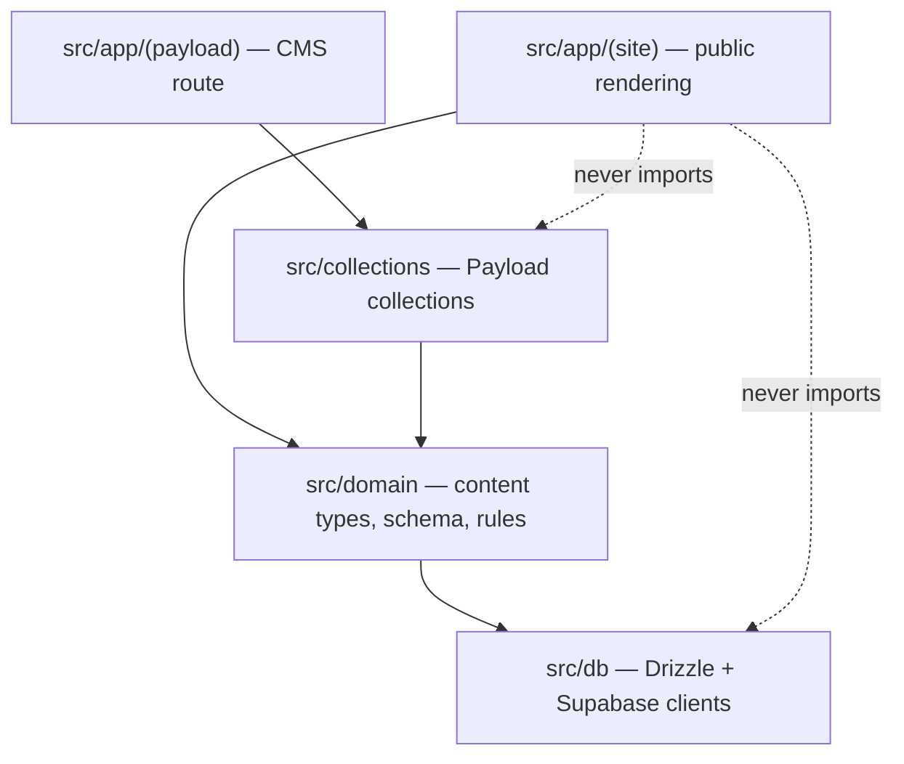
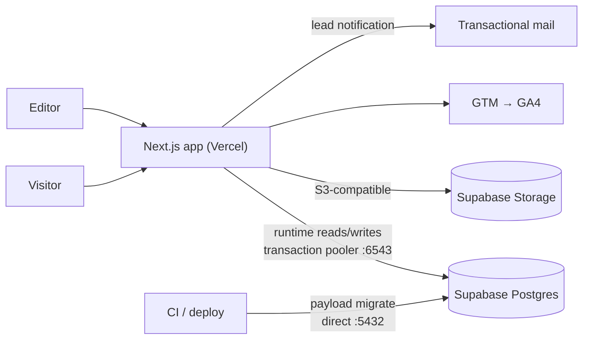
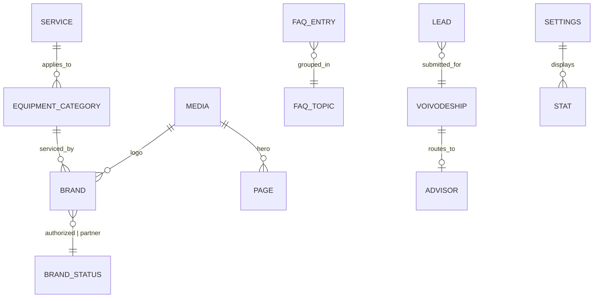

# Architecture Spine — iziservis

## Design Paradigm

**Layered, single deployable.** One Next.js application serves both the public
site and the Payload admin. Payload is not a separate service; it is a set of
route handlers and a database adapter co-located in the same app, which is why
"headless CMS on a separate route" is a routing concern rather than an
infrastructure one.

Three layers, and dependencies point one way only:

| Layer | Namespace | Owns |
|---|---|---|
| Rendering | `src/app/(site)` | Server components, pages, metadata, JSON-LD emission |
| Domain | `src/domain` | Content types, schema derivation, routing rules, validation |
| Persistence | `src/collections`, `src/db` | Payload collections, Drizzle migrations, Supabase clients |



The public rendering layer never imports a Payload collection or a database
client directly. It asks the domain layer for content. This is what keeps the
CMS replaceable and, more immediately, keeps the admin bundle out of the public
bundle.

## Invariants & Rules

### AD-1 — Media cannot exist without alt text

- **Binds:** FR-1
- **Prevents:** the legacy site's defining defect — 244 images, zero `alt` —
  being rebuilt into the new one by an editor in a hurry.
- **Rule:** the `media` collection declares `alt` as `required: true` **and** a
  `beforeValidate` hook rejects whitespace-only values. Decorative images are
  expressed by an explicit `decorative: boolean` that renders `alt=""`. The
  front-end `<Image>` wrapper takes `alt` as a required prop with no default,
  so a missing value is a type error, not a runtime one. Validation lives in
  the collection, not in the admin UI, so the REST and GraphQL surfaces reject
  it too.

### AD-2 — Two connection strings, never one

- **Binds:** FR-4, all persistence
- **Prevents:** migrations silently failing or corrupting state against
  Supabase's transaction pooler, which does not support prepared statements.
- **Rule:** `DATABASE_URL` is the runtime connection (transaction pooler, port
  6543, `pgbouncer=true`). `DATABASE_DIRECT_URL` is the migration connection
  (session pooler, port 5432). Payload's `pool.connectionString` uses the
  former; `payload migrate` and every Drizzle CLI command use the latter.
  Neither is ever substituted for the other.
- **[ADOPTED]** Verified against the live project on 2026-07-10. The direct
  host `db.<ref>.supabase.co` does **not resolve** on this project — no A and
  no AAAA record — so the session pooler on port 5432 stands in for it. Both
  pooler endpoints were confirmed reachable; Postgres is 17.6 in
  `eu-central-1`.

### AD-3 — Push mode never touches production

- **Binds:** FR-4
- **Prevents:** the state corruption Payload's own docs warn about — push mode
  "should not be mixed with manually running migrate commands."
- **Rule:** `push` is enabled in development only. Every schema change is
  committed as a generated Drizzle migration. Production and preview deploys
  run `payload migrate` before serving. A deploy whose migration fails does not
  serve.

### AD-4 — Structured data is derived, never authored

- **Binds:** FR-11, FR-12
- **Prevents:** JSON-LD drifting out of sync with the content it describes —
  the exact failure the legacy site exhibits, where Rank Math emits `Article`
  and `Person` for a local repair business.
- **Rule:** every JSON-LD node is produced by a pure function in
  `src/domain/schema/` that takes a CMS document and returns the object.
  `openingHours` comes from the settings global. `areaServed` comes from the
  coverage content. No template contains a literal schema string. A test
  asserts that no page emits `Article` or `Person`.

### AD-5 — Legacy metadata is data, not generated output

- **Binds:** FR-10
- **Prevents:** an SEO plugin regenerating the 22 hand-written, non-duplicated
  titles and descriptions that currently rank.
- **Rule:** `title` and `description` are plain required fields on the page
  collections, seeded from
  [content-inventory.md](../../../source/content-inventory.md). Next's
  `generateMetadata` reads them verbatim. `@payloadcms/plugin-seo` is **not**
  installed; its preview and generation affordances invite exactly the
  regeneration this rule forbids.

### AD-6 — The redirect map is a tested artifact

- **Binds:** FR-9, FR-13
- **Prevents:** a rename losing an indexed URL, and redirect chains
  accumulating as the IA evolves.
- **Rule:** all redirects live in one module, `src/domain/redirects.ts`, as
  data. A test enumerates the 22 legacy paths from the recorded sitemap and
  asserts each resolves 200 or 301 in a single hop. Adding a redirect whose
  target is itself a redirect fails the test.

### AD-7 — Colour tokens are contrast-tested, not eyeballed

- **Binds:** FR-6
- **Prevents:** shipping the design reference's `#419D45` under white button
  text, which measures 3.42:1 against a 4.5:1 requirement.
- **Rule:** tokens are declared once in `src/design/tokens.ts` with an explicit
  `usableAs` annotation (`'text-on-light' | 'surface-under-white-text' |
  'nontext-only'`). A unit test computes the WCAG contrast ratio for every
  permitted pairing and fails below threshold. `brand-green` is
  `nontext-only`. Tailwind consumes the same token module, so no hex literal
  appears in a component.

### AD-8 — A lead is persisted before it is mailed

- **Binds:** FR-14
- **Prevents:** an SMTP failure silently destroying a conversion — the site's
  single revenue event.
- **Rule:** the contact handler writes the submission to Postgres inside a
  transaction, and only then dispatches mail. Mail dispatch failure is logged
  and retried out of band; it never fails the request or the user's
  confirmation. The voivodeship→advisor mapping is CMS content with a
  `biuro@iziserwis.pl` fallback, so an unmapped region degrades to delivered,
  never to dropped.

### AD-9 — The service-role key never crosses the network boundary

- **Binds:** FR-4, §5 Security
- **Prevents:** full database compromise from a client bundle leak.
- **Rule:** `SUPABASE_SERVICE_ROLE_KEY` and both `DATABASE_*` URLs are
  server-only, read exclusively in server components, route handlers and
  Payload config. RLS denies by default on every table. Any module importing
  them carries `import 'server-only'`.

### AD-10 — The CMS route is invisible to crawlers and to the public bundle

- **Binds:** FR-4
- **Rule:** Payload mounts under the `(payload)` route group. It emits
  `noindex`, is `Disallow`ed in `robots.txt`, is excluded from the sitemap, and
  is authenticated server-side on every request. No module under
  `src/app/(site)` may import from `src/app/(payload)` or `src/collections`.

### AD-11 — Accessibility is a build gate

- **Binds:** FR-5, FR-7, FR-8
- **Prevents:** a11y regressing into a pre-launch audit item, which is how the
  legacy site reached 244 alt-less images.
- **Rule:** CI runs axe-core against every rendered route at WCAG 2.2 A and AA.
  Any violation fails the build. The contact form additionally carries
  keyboard-navigation and focus-management tests. No suppression file exists.

### AD-12 — No tag fires before consent

- **Binds:** FR-17
- **Rule:** GTM is the only tag surface; GA4 is configured inside it. The GTM
  container is not injected until consent is granted. No analytics identifier
  appears in application source. *(The legacy site hard-codes `G-99MVR70KRC`.)*

## Consistency Conventions

| Concern | Convention |
|---|---|
| Naming — collections | Singular Polish domain nouns in English code: `pages`, `services`, `equipmentCategories`, `brands`, `faqEntries`, `stats`, `media`, `voivodeships`, `leads` |
| Naming — files | `kebab-case.ts`; React components `PascalCase.tsx`; one component per file |
| Naming — schema functions | `src/domain/schema/<type>.ts` exporting `build<Type>Schema(doc)` |
| Ids | Postgres `uuid` primary keys, generated by the database |
| Dates | ISO 8601, stored `timestamptz`, always UTC |
| Content locale | Every user-visible string is a CMS field. No Polish literal in a `.tsx` file. |
| Errors | Route handlers return `{ error: { code, message } }`; `code` is a stable machine string, `message` is Polish and user-facing |
| Mutation | Public site is read-only against the CMS. The only public write is `leads`. |
| Config | All environment access via `src/env.ts`, validated at boot; a missing variable fails startup, never at request time |
| Auth | Payload's own auth for the admin. No end-user accounts exist. |
| Logging | Structured JSON. A lead's contents are never logged; its id is. |

## Stack

Verified against the npm registry on 2026-07-10. Pinned, not recalled.

| Name | Version |
|---|---|
| Node.js | 24.18.0 (LTS) |
| pnpm | 11.11.0 |
| TypeScript | 7.0.2 |
| Next.js | 16.2.10 |
| React | 19.2.7 |
| Payload | 3.85.2 |
| `@payloadcms/next` | 3.85.2 |
| `@payloadcms/db-postgres` | 3.85.2 |
| `@payloadcms/richtext-lexical` | 3.85.2 |
| `@payloadcms/storage-s3` | 3.85.2 |
| `@payloadcms/plugin-form-builder` | 3.85.2 |
| Tailwind CSS | 4.3.2 |
| Supabase (Postgres + Storage) | managed |

**The Next/Payload pin is load-bearing.** `@payloadcms/next@3.85.2` declares a
peer range of `next: >=16.2.6 <17.0.0` (among older windows). Next 16.2.10
satisfies it. A routine Next minor bump outside that range breaks the admin
route, so both versions move together or not at all.

`@payloadcms/plugin-seo` is deliberately absent — see AD-5.

## Structural Seed

### Containers



The two arrows into Postgres are the whole of AD-2: they are different ports,
different pooling modes, and different credentials.

### Core entities



`BRAND_STATUS` is a legal distinction, not a display preference (AD-1's sibling
concern, enforced by FR-2). `STAT` carries a non-empty `source` or it cannot be
published (FR-3).

### Source tree

```text
iziservis/
  src/
    app/
      (site)/            # public routes; server components only
        layout.tsx       # emits LocalBusiness JSON-LD once
        [...slug]/       # CMS-driven pages
        urzadzenia/      # equipment categories — click depth 1 (FR-13)
        uslugi/
        kontakt/
      (payload)/         # Payload admin + REST/GraphQL; noindex, authed
    collections/         # Payload collections — persistence layer
    domain/
      schema/            # buildLocalBusinessSchema, buildServiceSchema, ...
      redirects.ts       # the tested redirect map (AD-6)
      content.ts         # the only surface (site) may call
    design/
      tokens.ts          # contrast-annotated colour tokens (AD-7)
    db/
      migrations/        # committed Drizzle migrations (AD-3)
    env.ts               # validated at boot
  tests/
    a11y/                # axe-core over every route (AD-11)
    seo/                 # metadata equality vs content-inventory (AD-5)
    redirects/           # all 22 legacy paths, single hop (AD-6)
    contrast/            # every permitted token pairing (AD-7)
  docs/
```

The four test directories are not incidental. Each one guards an invariant that
the legacy site violated, and each corresponds to an AD above.

### Environments

| Environment | Database | Push mode | Migrations |
|---|---|---|---|
| Local | Supabase branch or local Postgres | on | not run |
| Preview | Supabase branch | off | run on deploy |
| Production | Supabase project | off | run on deploy, gates serving |

## Capability → Architecture Map

| Capability / FR | Lives in | Governed by |
|---|---|---|
| FR-1 required alt | `src/collections/media.ts`, `src/app/(site)` image wrapper | AD-1 |
| FR-2 brand authorization | `src/collections/brands.ts` | AD-4 (rendering), FR-2 |
| FR-3 sourced stats | `src/collections/stats.ts` | — |
| FR-4 editor autonomy | `src/app/(payload)` | AD-3, AD-9, AD-10 |
| FR-5–FR-8 accessibility | `src/design`, `tests/a11y` | AD-7, AD-11 |
| FR-9 URL preservation | `src/domain/redirects.ts`, `tests/redirects` | AD-6 |
| FR-10 metadata verbatim | page collections, `generateMetadata`, `tests/seo` | AD-5 |
| FR-11–FR-12 structured data | `src/domain/schema/` | AD-4 |
| FR-13 click depth | `src/app/(site)/urzadzenia` | AD-6 |
| FR-14–FR-16 leads | `src/app/(site)/kontakt`, `src/collections/leads.ts` | AD-8 |
| FR-17 analytics | consent gate + GTM | AD-12 |
| FR-18 baseline | operational, pre-cutover | — |

## Deferred

- **Hosting platform.** Vercel is assumed (Next 16, first-party Payload
  support, a connector is already available in this workspace) but not
  contracted. Nothing above depends on it except the deploy-time migration
  hook, which any platform can run.
- **Transactional mail provider.** AD-8 fixes the ordering — persist, then
  mail — which is the part that matters. The provider is a swappable adapter.
- **Blog / post type.** Blocked on PRD OQ-3. The `pages` collection is
  deliberately generic so a `posts` collection can be added without touching
  the rendering layer.
- **Second locale.** No copy lives in templates (see Consistency Conventions),
  which is the only decision that has to be made now. Payload's localization is
  turned on later without a data migration.
- **Per-region pages.** The growth thesis. `areaServed` already derives from
  content rather than a constant, which is the one thing that would otherwise
  need rework.
- **Supabase provisioning.** Blocked: the Supabase connector is not authorized
  in the current session, so the project, schema and RLS policies cannot be
  applied yet.
